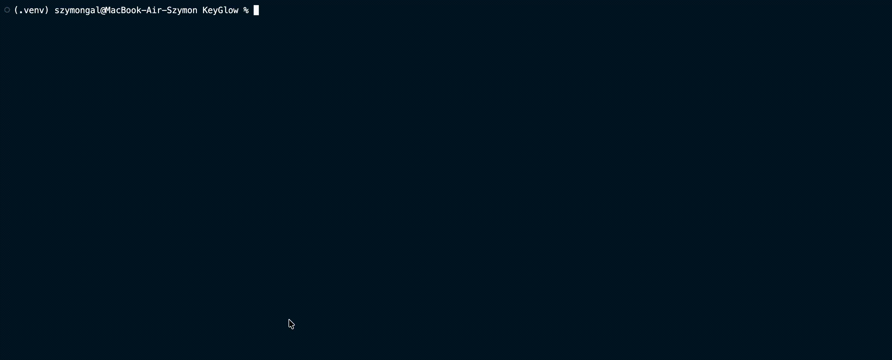
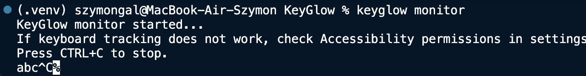
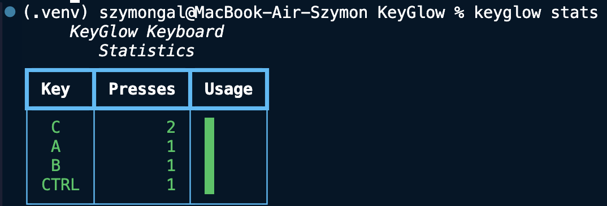
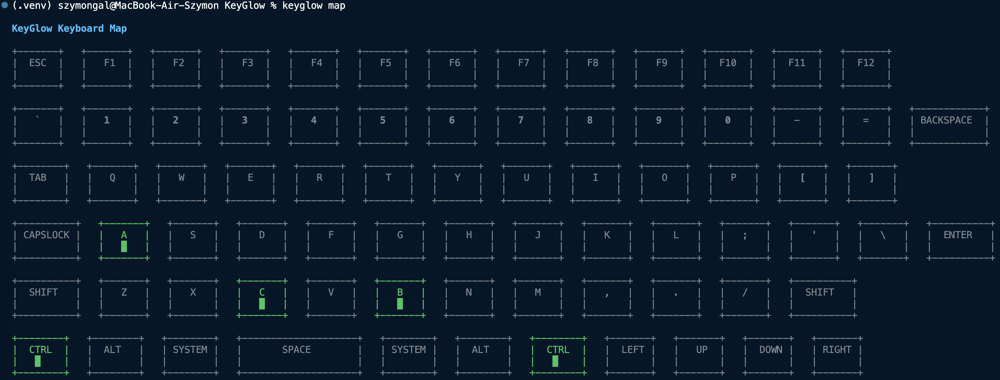

# KeyGlow
[](https://opensource.org/licenses/MIT)

Privacy-first keyboard usage heatmap and statistics CLI tool.

KeyGlow is a lightweight command-line application that tracks keyboard usage statistics, generates keyboard heatmaps, and helps you understand your typing habits.

Unlike keyloggers, KeyGlow does **not** record what you type (typing sequences)

It only stores anonymous key frequency counters:

```json
{
    "A": 245,
    "SPACE": 1200,
    "ENTER": 83
}
```
It does not save typed text, passwords, or key sequences.
Only keyboard usage statistics.

# Features

- Keyboard usage heatmap
- Real-time keyboard monitoring
- Keyboard and mouse inactivity detection
- Keyboard statistics
- Total key press counter
- JSON / CSV / TXT exports
- Local only data storage in ~/KeyGlow/ directory.
- Automated Saving
- Automatic inactivity shutdown after certain time passed in a parameter

# Installation

## Requirements

- Python 3.10+
- pip

Install keyglow:

```bash
pip install keyglow
```



Run:

```bash
keyglow --help
```

# Commands

## version

Show KeyGlow version.

```bash
keyglow version
```

## privacy

Display KeyGlow privacy model.

```bash
keyglow privacy
```

## monitor

Start keyboard monitoring.

```bash
keyglow monitor
```



Keyglow tracks keyboard and mouse inactivity.

Default inactivity timeout:

```
10 minutes
```

Change timeout:

```bash
keyglow monitor --timeout 30
```

Disable automatic shutdown:

```bash
keyglow monitor --timeout 0
```

## stats

Show keyboard statistics.

```bash
keyglow stats
```

Example:

```
KeyGlow Keyboard Statistics

Key     Presses     Usage

SPACE   5420        ██████████

E       3120        ███████

ENTER   430         █
```



## map

Display keyboard primitive heatmap.
Displayed keyboard may not recreate your keyboard's alignment the same way, but it does contain most of commonly used keys.

```bash
keyglow map
```



## total

Show total recorded key presses.

```bash
keyglow total
```

Example:
```
KeyGlow Total Key Presses
Total Presses: 125,340
```

## export

Export collected statistics.

JSON:

```bash
keyglow export json
```

CSV:

```bash
keyglow export csv
```

TXT:

```bash
keyglow export txt
```

Exports are stored in:

```
~/KeyGlow/Exports/
```

## reset

Delete all collected statistics. (It does not delete exported files though)

```bash 
keyglow reset
```

KeyGlow asks for confirmation before deleting data.

## man

Display the KeyGlow manual.

```bash
keyglow man
```

## joke

Display a random (really funny trust me) joke about keyboard.

```bash
keyglow joke
```

## info

Show informations about the version, amount of stored keys, total key presses, storage file size and path to export folder.

```bash
keyglow info
```

## logo

Show a KeyGlow logo.

```bash
keyglow logo
```

# Privacy Model

KeyGlow was designed with privacy as a priority.

## Collected

Only anonymous key frequency counters.

Example:

```json
{
    "A": 500,
    "CTRL": 120,
    "SPACE": 900
}
```

## Never Collected

- Typed text sequences
- Passwords
- Sentences
- Data stored in Clipboard
- Websites
- Apps

# Data Storage

KeyGlow stores all the data locally.

Main database:
```
~/KeyGlow/keyglow_data.json
```

Exports:
```
~/Keyglow/Exports/
```

No cloud synchronization, no external servers, no network needed

# Supported Keys

## Letters

A-Z

## Numbers

0-9

## Function Keys

F1-F12

## Special Keys

- ESC
- TAB
- ENTER
- BACKSPACE
- CAPSLOCK
- SPACE

## Modifiers

- SHIFT
- CTRL
- ALT
- SYSTEM

## Navigation

- UP
- DOWN
- LEFT
- RIGHT

# Technologies

KeyGlow is built with:

- Python
- Typer
- Rich
- Pynput

# Files:
```
keyglow/

    - main.py
    - monitor.py
    - storage.py
    - export.py
    - map.py
    - keyboard.py
    - data.py
    - joke.py
    - logo.py
```

# Development

Clone repo:

```bash
git clone https://github.com/aerissdev-dotcom/KeyGlow.git
```

Install dependencies:

```bash
pip install -r requirements.txt
```

Run:

```bash
python main.py --help
```

# License

MIT License

# Author

aeriss-dev

GitHub:

https://github.com/aerissdev-dotcom

# Version

0.1.0

# Testing and developing OS:

KeyGlow was fully tested and developed on macOS. The author does **not** guarantee this tool will work on other operating systems.

# OS Compatibility

## macOS

KeyGlow requires Accessibility permission.

System Settings:
Privacy & Security -> Accessibility

Add your Terminal application.

## Windows

No additional permissions are normally required.

## Linux

Works best on X11 sessions.
Wayland sessions may require additional configuration due to system restrictions.

# Conclusion

It's a free, silly little tool that might brighten someone's day, and for some specific people, give interesting statistics.


